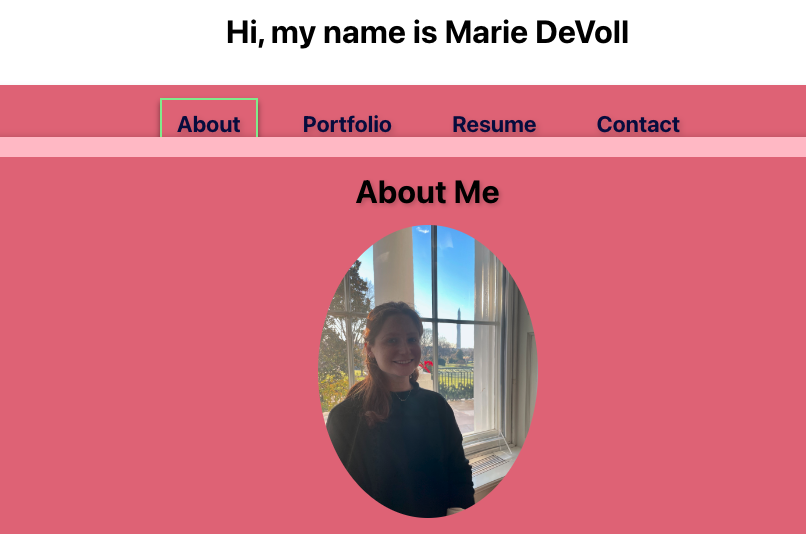

# React Profile

This project was bootstrapped with [Create React App](https://github.com/facebook/create-react-app).

## Project Description
We were challenged to create a new profile page for potential employeers to see our work. I have added 3 of my projects, my resume, and a way for views to contact me with questions or inquieries.

## Install
Here is the link to the live app for my profile page: https://main--cozy-gaufre-d3dbdd.netlify.app/
 
Here is the link to the GitHub repository: https://github.com/mariedevoll/mod-20-round2

## Usage
The following sections are included: 

- Home/About: includes a brief introduction of myself and my photo
- Portfolio: includes 3 of my projects that I completed during bootcamp
- Resume: a copy of my updated resume
- Contact: a form for users to fill out and send me a message

## License
This project is licensed under the [MIT License](LICENSE). See the LICENSE file for details.

